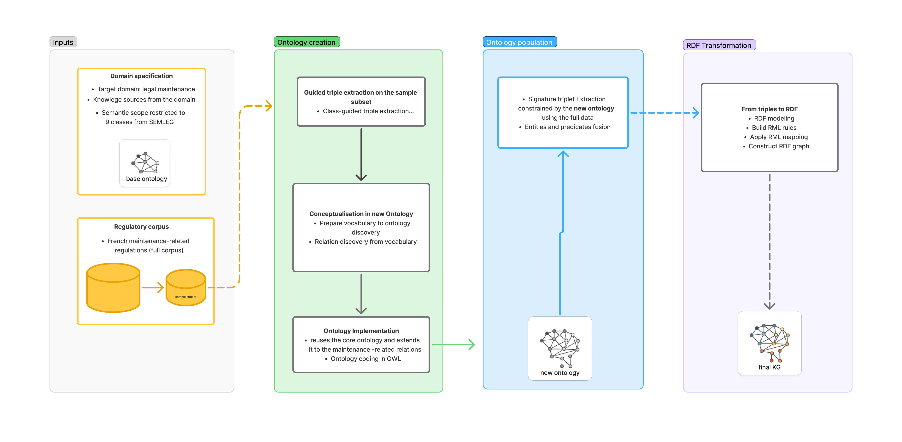

# LegiMaintLex

**LegiMaintLex: LLM-based and Methontology-informed ontology extraction and population for a French Legal KG on Maintenance Regulations**

This project presents LegiMaintLex, an approach for ontology extraction and population from French maintenance regulations, combining large language models (LLMs) with a Methontology-informed process. The proposed pipeline relies on signature-driven triple extraction to identify structured relation patterns from regulatory text.



## Repository Layout

- `src/data/`: source datasets, base ontologies, and the base RML mapping.
- `src/kg_creation/`: pipeline runners and dataset creation scripts.
- `src/preprocess/`: preprocessing utilities, flattening scripts, RML rule generation, and RDF creation.
- `config/`: YAML experiment configurations.
- `exp/new_ontology/`: ontology discovery and extended ontology outputs.
- `exp/kg/`: full extraction outputs for OpenAI and Mistral experiments.

## Setup

Use Python 3.12 if possible. The repository was developed with a local virtual environment.

```powershell
python -m venv .venv
.\.venv\Scripts\Activate.ps1
pip install -r requirements.txt
```

Set the API key for the provider you want to use:

```powershell
$env:OPENAI_API_KEY="..."
$env:MISTRAL_API_KEY="..."
```

## 1. Extend the Ontology

The ontology extension pipeline starts from ontology-guided extraction on a balanced corpus sample, merges similar extracted elements, prepares discovery data, runs ontology discovery, and converts the discovered candidates into extended OWL/Turtle ontologies.

### 1.1  Multi-step ontology-guided triple extraction

**Algorithm:** Multi-step ontology-guided triple extraction  
**Implementation:** `triples_extraction_ontology_guided.py`  

**Require:** Article set $A=\{a_1,\dots,a_n\}$ sampled from corpus $D$, core class set $C_{core}$, LLM provider $\rho$, model $m$  
**Ensure:** Triple set $T_i$

1. For each article $a_i \in A$:
   - $x_i \gets$ textual content of $a_i$
   - Build the entity extraction prompt $\pi_i^{ent}$ from $(x_i, C_{core})$
   - Query $(\rho,m)$ with $\pi_i^{ent}$ to get the typed entity set $E_i$
   - Build the relation extraction prompt $\pi_i^{rel}$ from $(x_i, E_i, C_{core})$
   - Query $(\rho,m)$ with $\pi_i^{rel}$ under class-level guidance to get the triple set $\widehat{T}_{i}$
   - If $\widehat{T}_{i}$ is valid:
     - Build the topic classification prompt $\pi_i^{topic}$ from $(x_i, \widehat{T}_{i})$
     - Query $(\rho,m)$ with $\pi_i^{topic}$ to get the final triple set $T_i$
1. Return $T_i$

### 1.2  Type-aware label fusion over maintenance triples

**Algorithm:** Type-aware label fusion over maintenance triples  
**Implementation:** `elements_merge_and_filtered.py`  
**Require:** Extracted triple set $T_i$, thresholds $\theta_E,\theta_P$, embedding provider $\rho$, embedding model $m$  
**Ensure:** Fused maintenance triple set $T_{\mathrm{maint}}^{fused}$

1. $T_{\mathrm{maint}} \gets \{t \in T_i \mid \texttt{topic}(t)=\texttt{maintenanceActivity}\}$
1. For each class $c$ in $T_{\mathrm{maint}}$:
   - $E_c \gets$ entity labels $E_i$ of class $c$
   - Group $E_c$ by cos\_sim over $\ell_2$-normalized embeddings using threshold $\theta_E$
   - Replace each label in group by its canonical entity label
1. For each property signature $s=(c_{e_s}, c_{e_o})$ in $T_{\mathrm{maint}}^{norm}$:
   - $P_s \gets$ property labels $P_i$ with signature $s$
   - Group $P_s$ by cos\_sim over $\ell_2$-normalized embeddings using threshold $\theta_P$
   - Replace each label in group by its canonical property label
1. Return $T_{\mathrm{maint}}^{fused}$

| Topic | Evidence (EN) | Evidence (FR) |
|------|---------------|---------------|
| *anotherLegalActivity* | "A health, safety and working conditions committee is established under the authority of the director of the Centre for Studies and Research on Qualifications." | "Il est créé auprès du directeur du Centre d'études et de recherches sur les qualifications un comité d'hygiène, de sécurité et des conditions de travail." |
| *legalCrossReference* | "the minimum age required by Articles R. 221-5 and R. 221-6 of the Road Code" | "l'âge minimal requis par les articles R. 221-5 et R. 221-6 du code de la route" |
| *maintenanceActivity* | "The calculation of the maximum short-circuit current ... based on: - the maximum voltage to which the installation may be subjected." | "Le calcul du courant de court-circuit maximum ... sur la base: - de la tension maximale à laquelle l'installation est susceptible d'être soumise." |

### 1.3 Preparation and Batch-Based Ontology Construction from Extracted Triple

**Algorithm:** Preparation and Batch-Based Ontology Construction from Extracted Triples  
**Implementation:** `prepare_data_for_ontology_discovery.py`, `ontology_discovery_from_triples.py`  

**Require:** Maintenance triple $T_{\mathrm{maint}}^{fused}$ set, core ontology $O_{core}$, competency questions $Q$, LLM provider $\rho$, model $m$  
**Ensure:** Candidate property set $P_{cand}$

1. $T_{\mathrm{maint}}^{clean} \leftarrow$ triples retained after removing explicit extraction errors from $T_{\mathrm{maint}}^{fused}$ via syntactic and semantic filtering
1. For each triple $t_j$:
   - $t_j = (e_s, r_p, e_o) \in T_{\mathrm{maint}}^{\mathrm{clean}}$
   - Build its signature $\sigma_j = (c_{e_s}, r_p, c_{e_o})$
1. Construct a stratified sample $T_{\mathrm{maint}}^{sample}$ from $T_{\mathrm{maint}}^{clean}$
   - Comment: for each signature group, retain $5\%$ of triples with at least one triple per group
1. Partition $T_{\mathrm{maint}}^{sample}$ into batches $B = \{b_1, \dots, b_K\}$ of size 15
1. For each batch $b_k \in B$:
   - Serialize each triple $t_j$ in $b_k$ into a compacted JSON
   - Build a relation discovery prompt $\pi_k^{\mathrm{rel\_disc}}$ from $O_{core}$, $Q$, and $b_k$
   - Query the LLM (model $(\rho, m)$) using the constructed prompt to obtain $P_{cand}^{(k)}$
   - Aggregate $P_{cand}^{(k)}$ into $P_{cand}$
1. Return $P_{cand}$

### 1.4 Implementation in code

Run the Mistral ontology extension experiment:

```powershell
python src/kg_creation/run_pipeline.py --config config/experiments/full/mistral_full.yaml
```

Run the OpenAI ontology extension experiment:

```powershell
python src/kg_creation/run_pipeline.py --config config/experiments/full/openai_full.yaml
```

Useful dry run:

```powershell
python src/kg_creation/run_pipeline.py --config config/experiments/full/mistral_full.yaml --dry-run
```

Main outputs:

- `exp/new_ontology/mistral/ontology_extended_mistral.ttl`
- `exp/new_ontology/openai/ontology_extended_openai.ttl`
- `exp/new_ontology/agreement/ontology_extended_agreement.ttl` when the configuration requests the agreement variant

The relevant stages are defined in `config/base_pipeline_ont_ext.yaml`:

- `triplets_extraction_ontology_guided`
- `elements_merge_and_filtered`
- `prepare_data_for_ontology_discovery`
- `ontology_discovery_from_triplets`
- `from_ontology_discovery_to_owl`

## 2. Extract Legal Triples

After the ontology has been extended, run the full constrained extraction over the main corpus. These configurations use the provider-specific extended ontology as extraction constraints.

### 2.1 Signature-guided knowledge graph construction

**Algorithm:** Signature-guided knowledge graph construction  
**Implementation:** `triples_extraction_signature_guided.py`  

**Require:** Article set $A=\{a_1,\dots,a_n\}$ from corpus $D$, classes $C_{new}$, new ontology $O_{new}$, LLM provider $\rho$, model $m$  
**Ensure:** Signature-guided knowledge graph $G_{sig}$

1. For each article $a_i \in A$:
   - $x_i \gets$ textual content of $a_i$
   - Build the entity extraction prompt $\pi_i^{ent}$ from $(x_i, C_{new})$
   - Query $(\rho,m)$ with $\pi_i^{ent}$ to get the typed entity set $E_i$
   - Build the relation extraction prompt $\pi_i^{rel}$ from $(x_i, E_i, O_{new})$
   - Query $(\rho,m)$ with $\pi_i^{rel}$ under signature-level guidance to get the triple set $T_i$
1. Apply embedding-based fusion to $T_{raw}$ exactly as described in Algorithm `alg:type_aware_label_fusion` to obtain $G_{sig}$
1. Return $G_{sig}$

### 2.2 Implementation in code

Run Mistral extraction:

```powershell
python src/kg_creation/run_pipeline.py --config config/experiments/dataset_full/mistral_full_constrained.yaml
```

Run OpenAI extraction:

```powershell
python src/kg_creation/run_pipeline.py --config config/experiments/dataset_full/openai_full_constrained.yaml
```

Dry run:

```powershell
python src/kg_creation/run_pipeline.py --config config/experiments/dataset_full/mistral_full_constrained.yaml --dry-run
```

Main outputs:

- `exp/kg/mistral/full_constrained_extraction_by_mistral_mistral-large-latest_nrows_6370.csv`
- `exp/kg/mistral/full_constrained_extraction_by_mistral_mistral-large-latest_nrows_6370_input.csv`
- `exp/kg/openai/full_constrained_extraction_by_openai_gpt-4.1_nrows_6370.csv`
- `exp/kg/openai/full_constrained_extraction_by_openai_gpt-4.1_nrows_6370_input.csv`

The `_input.csv` files keep the source rows used for extraction. They are important for recovering source metadata such as article identifiers and dates.

## 3. Transform the Extraction Results into RDF

Use `src/kg_creation/csv_to_rdf_transform.py` to run the RDF transformation pipeline. This script orchestrates the required intermediate steps:

1. build ontology-driven RML rules from the extended ontology;
2. merge semantically similar extracted entities and relations across all extracted triples, without topic filtering;
3. flatten the merged triples, entities, and mentions;
4. prepare RML-ready CSV sources;
5. patch the generated RML mapping to use those generated CSV sources;
6. apply the RML mapping to create RDF.

### RDF Graph Generation from Triples

The RDF generation step converts the ontology-guided extraction output into a provenance-aware knowledge graph. The input is first normalized by merging equivalent entity and relation labels over the complete set of extracted triples. This merge step is run with `--topic-filter all`, so no triples are discarded by topic. The merged row-level extraction file is then flattened into three tabular sources: legal documents/articles, normalized triples, and mention spans. These CSV sources are the logical inputs of the RML mapping.

The graph model combines standard legal, annotation, provenance, and lexical vocabularies with the project ontology. Legal documents are represented with ELI: each distinct document title is assigned a stable `document_key` and represented as an `eli:LegalResource`, while each article is represented as an `eli:LegalResourceSubdivision` linked to its parent document with `eli:is_part_of`. Document and article metadata is expressed with `dcterms:title`, `dcterms:type`, `dcterms:subject`, `eli:id_local`, `eli:number`, and `oa:sourceDateStart`. Article text is modeled as `cnt:ContentAsText` and linked from the article with `semleg:hasContent`.

Extracted heads and tails are modeled as reusable entity resources. Each entity is typed both as `prov:Entity` and `skos:Concept`, receives an `rdfs:label`, and is assigned its semantic class from the extended SemLeg ontology, such as `semleg:Action`, `semleg:Actor`, `semleg:Artifact`, `semleg:Condition`, `semleg:Location`, `semleg:Source`, or maintenance-specific classes under `semlegm:`. Relations are materialized as direct RDF assertions from the head entity to the tail entity using the ontology property resolved for the extracted predicate. In parallel, each extracted relation is reified as an `rdf:Statement` and `semleg:ExtractedRelation`, with `rdf:subject`, `rdf:predicate`, `rdf:object`, `dcterms:subject` for the topic, and `prov:wasDerivedFrom` linking the assertion back to the source article.

Textual grounding is represented with the Web Annotation vocabulary. Each grounded head or tail mention is an `oa:Annotation` whose body is the entity resource and whose target points to the source article. The target contains an `oa:TextPositionSelector` with `oa:start` and `oa:end`, preserving the character offsets of the mention in the article text. The RDF generation process itself is represented as a `prov:Activity`, allowing generated annotations and statements to be connected to the dataset creation activity.

The transformation is controlled by RML-style mapping rules. The base mapping in `src/data/csv_to_rml_mapping.ttl` defines the CSV logical sources, URI templates, classes, datatypes, and predicate-object maps used to build the graph. Before graph creation, `src/preprocess/build_rml_extraction_rules_from_ontology.py` reads the provider-specific extended ontology and appends generated rules for every ontology class, object property, and domain/range signature. These rules record the correspondence between extracted labels and ontology IRIs through `map:ExtractionClassRule`, `map:ExtractionRelationRule`, and `map:ExtractionDomainRangeRule`. The pipeline then patches the generated mapping so that its logical sources point to the provider-specific RML CSV files and applies the mapping with either the built-in lightweight RML engine or PyRML.

Run the full RDF transformation for Mistral:

```powershell
python src/kg_creation/csv_to_rdf_transform.py --provider mistral
```

Run it for OpenAI:

```powershell
python src/kg_creation/csv_to_rdf_transform.py --provider openai
```

Run it for both providers:

```powershell
python src/kg_creation/csv_to_rdf_transform.py --provider all
```

Dry run:

```powershell
python src/kg_creation/csv_to_rdf_transform.py --provider mistral --dry-run
```

Useful debugging options:

```powershell
python src/kg_creation/csv_to_rdf_transform.py --provider mistral --max-rows 10 --kg-max-rows-per-source 10
```

Start from flattening when ontology rules and normalized/merged inputs already exist or should be skipped:

```powershell
python src/kg_creation/csv_to_rdf_transform.py --provider mistral --start-at flatten
```

The transformation uses:

- base mapping: `src/data/csv_to_rml_mapping.ttl`
- ontology-driven rule builder: `src/preprocess/build_rml_extraction_rules_from_ontology.py`
- entity/relation merge script: `src/kg_creation/elements_merge_and_filtered.py`
- flattening script: `src/preprocess/flatten_kg_results.py`
- RDF generator: `src/preprocess/create_kg_from_rlm.py`

Main generated files:

- RML rules: `exp/kg/{provider}/csv_to_rml_mapping_{provider}_rules.ttl`
- merged extraction results: `exp/kg/{provider}/*_elements_merged.csv`
- merged row-level extraction results: `exp/kg/{provider}/triplets_in_row_*_elements_merged.csv`
- entity/relation merge mappings: `exp/kg/{provider}/*_entity_mapping.*` and `*_relation_mapping.*`
- flat triples: `exp/kg/{provider}/*_legal_triplets_flat.csv`
- flat entities: `exp/kg/{provider}/*_legal_entities_flat.csv`
- flat mentions: `exp/kg/{provider}/*_legal_mentions_flat.csv`
- RML source CSVs: `exp/kg/{provider}/rml_sources/`
- RDF KG: `exp/kg/rdf/{provider}/csv_to_rml_mapping_{provider}_rules.ttl`

By default, the RDF generator uses the built-in lightweight RML subset engine. If `pyrml` is installed and available, the same script can be run with:

```powershell
python src/kg_creation/csv_to_rdf_transform.py --provider mistral --engine pyrml
```

## Running Individual RDF Steps

Build provider-specific RML rules only:

```powershell
python src/preprocess/build_rml_extraction_rules_from_ontology.py `
  --base-rml src/data/csv_to_rml_mapping.ttl `
  --ontology exp/new_ontology/mistral/ontology_extended_mistral.ttl `
  --output exp/kg/mistral/csv_to_rml_mapping_mistral_rules.ttl
```

Flatten extraction results only:

```powershell
python src/preprocess/flatten_kg_results.py `
  --provider mistral `
  --results-csv exp/kg/mistral/full_constrained_extraction_by_mistral_mistral-large-latest_nrows_6370.csv `
  --input-csv src/data/maintreg_database_clean.csv
```

Create RDF from an existing mapping only:

```powershell
python src/preprocess/create_kg_from_rlm.py `
  --provider mistral `
  --mapping exp/kg/mistral/csv_to_rml_mapping_mistral_rules.ttl `
  --format turtle
```

## Notes

- Use `--dry-run` on pipeline scripts before launching long LLM jobs.
- The full extraction and ontology discovery stages require provider API keys.
- The RDF transformation expects the extraction CSV and its corresponding corpus metadata to be available.
- Date values are normalized to `xsd:date` compatible lexical values during the RDF preparation step.

## License

This project is licensed under the MIT License. See [LICENSE](LICENSE).
